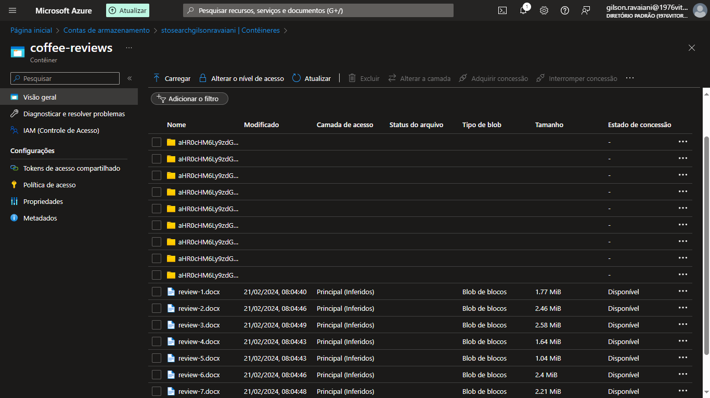
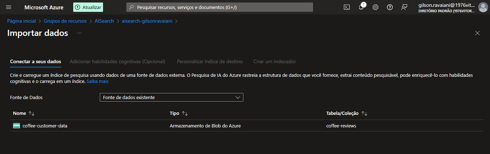
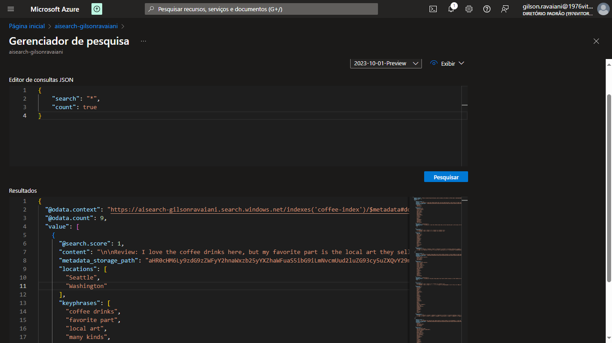
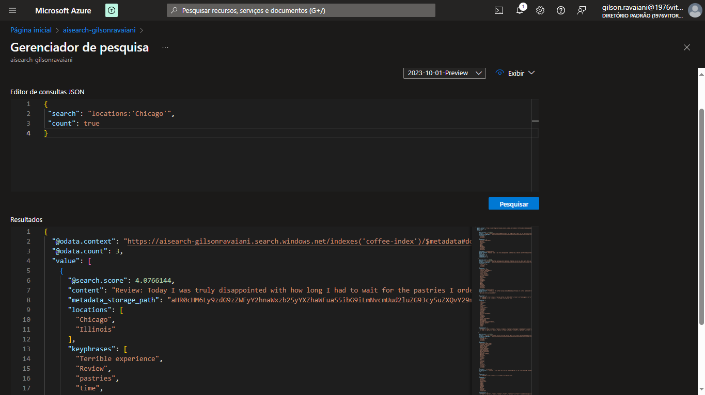
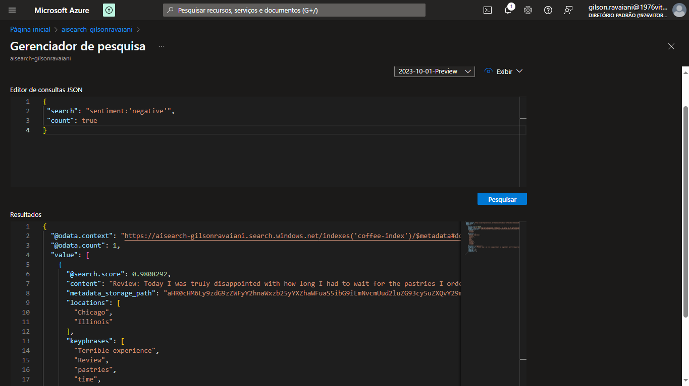

# Explorar um índice de Pesquisa de IA (UI) do Azure
 Explorar um índice de Pesquisa de IA (UI) do Azure

 Documentação seguida neste laboratório:

 https://aka.ms/ai900-ai-search

## Enriquecimento IA

## Connect search storage

## Search odata

## Search Chicago

## Search Sentiment

